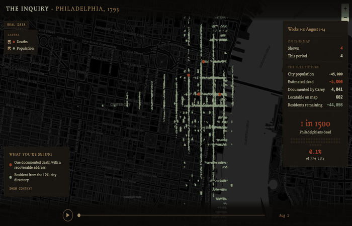

# Philadelphia 1793: A Structured Dataset of the Yellow Fever Epidemic

A structured, machine-readable dataset of the 1793 Philadelphia yellow fever epidemic, synthesizing multiple primary sources including Mathew Carey's death list and the 1791 Biddle Directory.

**[View the interactive map](https://alma-raya-studio.github.io/philadelphia-1793/visualization/)**



## What This Is

In the fall of 1793, yellow fever killed roughly 5,000 people in Philadelphia, then the capital of the United States, out of a population of about 45,000. Publisher Mathew Carey documented the crisis in *A Short Account of the Malignant Fever, Lately Prevalent in Philadelphia* (4th edition, January 1794), which included a 42-page list of the dead on pages 121-159.

Carey's list names approximately 4,041 individuals with their occupations, family relationships, and social status. It is one of the most detailed mortality records from any American epidemic before the 20th century.

**This project converts those sources into structured data** - parsing each entry into discrete fields (surname, first name, occupation, relationship, etc.) and cross-referencing across sources to recover street addresses where possible.

No comparable structured dataset of this epidemic exists.

## The Data

### Core Dataset: `data/carey_death_list.csv`

Every entry from Carey's list, parsed into structured fields. 4,229 rows.

| Column | Description | Example |
|--------|-------------|---------|
| `entry_id` | Sequential identifier | `12` |
| `raw_text` | Original text exactly as transcribed | `Adams, Moses, carpenter` |
| `surname` | Parsed surname | `Adams` |
| `first_name` | First name as it appears in the source | `Moses` |
| `first_name_expanded` | Abbreviated names expanded (Jas.->James, Wm.->William) | `Moses` |
| `suffix` | Titles or honorifics (Rev., Capt., Jr., etc.) | `Rev.` |
| `occupation` | Occupation or trade | `carpenter` |
| `relationship_type` | Family/social relationship if noted | `wife`, `child`, `widow` |
| `related_to_name` | Name of the person they're identified in relation to | `James` |
| `age` | Age if recorded (rare; uses "AEt" notation in original) | `70` |
| `origin` | Country of origin if noted | `France` |
| `descriptor` | Full descriptor text from the source | `carpenter` |
| `additional_persons` | Additional unnamed people in the same entry | `3 daughters` |
| `additional_persons_count` | Count of additional people | `3` |
| `entry_type` | `named`, `unnamed`, or `aggregate` | `named` |
| `confidence` | Parsing confidence: `high`, `medium`, or `low` | `high` |
| `flags` | Parsing notes (pipe-delimited) | `unknown_first_name` |

### Enriched Dataset: `data/carey_death_list_with_addresses.csv`

The core dataset plus address information from the 1791 Biddle Directory.

| Additional Column | Description |
|-------------------|-------------|
| `directory_name` | Matched name from the 1791 directory |
| `directory_address` | Street address from the directory |
| `directory_occupation` | Occupation as listed in the directory |
| `match_confidence` | `high`, `medium`, or `low` |
| `match_method` | How the match was made (see below) |

**Match methods:**
- `exact` - Surname + first name + occupation all match
- `name_only` - Surname + first name match (single match in directory)
- `relationship` - Entry is "wife/child of X"; X was found in directory
- `fuzzy (N)` - Fuzzy name match with score N (85-100)

**Current match rate: 15.7%** (666 of 4,229 entries). This is expected - many of the dead were women, children, servants, and recent immigrants who did not appear in the 1791 directory. Of entries with both a first name and occupation, 22.9% matched.

### JSON Format: `data/carey_death_list.json`

The core dataset in JSON format.

## Sources and Provenance

### Primary Source
**Mathew Carey, *A Short Account of the Malignant Fever, Lately Prevalent in Philadelphia* (4th edition). Philadelphia: Printed by the Author, January 15, 1794.**

Pages 121-159: "LIST of the names of the persons who died in Philadelphia, or in distant parts of the union, after their departure from this city, from August 1st, to the middle of December, 1793."

Digitized copy: [Internet Archive (NLM)](https://archive.org/details/2545039R.nlm.nih.gov)

### Transcription
The parsing is based on a plain-text transcription by **Marjorie B. Winter** (March 2005), contributed to the PAGenWeb Archives.

Source file: `http://files.usgwarchives.net/pa/philadelphia/history/local/yfever1793/dead.txt`

SHA-256: `14a2536cc05fb2c9244117b214077f4ff6e640d03500686d330c947cb4fd798a`

### Address Cross-Reference
**Billy G. Smith and Paul Sivitz, "Mapping Historic Philadelphia: 1791 Directory & 1790 US Census."** Magazine of Early American Datasets (MEAD), University of Pennsylvania Libraries.

The 1791 Biddle Directory file (`phil1791.xls`) was obtained from the [University of Delaware DSpace repository](https://udspace.udel.edu/handle/19716/1505).

SHA-256: `b1522e3d137cc041c54a7ec13d354de7d875a91b0f12dbea786951d5d6ffd42d`

## Methodology

### Parsing

Each line of the Winter transcription is parsed into structured fields using pattern matching. The transcription uses two delimiter formats:

1. **Dash-delimited**: `Abel, John – shoemaker` (~1,628 entries)
2. **Comma-separated**: `Adams, Moses, carpenter` (~255 entries)
3. **Name only**: `Abbot, Joseph` (~2,300 entries)

The parser handles possessive relationships (`James' wife`, `Robert's two children`), titles and honorifics (`Rev.`, `Capt.`), age notation (`Æt 70`), country of origin (`France`, `Portugal`), and compound entries (`wife and 3 daughters`).

18th-century name abbreviations are expanded in a separate column (`first_name_expanded`) while preserving the original text: Jas.->James, Wm.->William, Tho's.->Thomas, Jno.->John, Chas.->Charles, Benj.->Benjamin, etc.

### Address Matching

Death list entries are matched to the 1791 Biddle Directory using a tiered strategy:

1. **Exact**: surname + first name + occupation (including occupation synonyms like shoemaker/cordwainer)
2. **Name only**: surname + first name (when only one person with that name exists in the directory)
3. **Relationship**: for "wife/child of X" entries, look up X
4. **Fuzzy**: surname match + fuzzy first name match (threshold: 85%)

## Known Limitations

- **The death list does not contain addresses or dates of death.** Only names and occupations. Addresses come from cross-referencing a directory published two years earlier.
- **The transcription is a secondary source.** It has not been fully verified against the original page images. Some OCR-like errors may have been propagated.
- **The first entry in the original ("ABIGAIL, a negress") is missing from the transcription.** It appears on page 121 as a decorative drop-cap. This has been noted as an open question.
- **The transcription contains `??` markers** at the end whose meaning is unclear (transcriber uncertainty?).
- **Address matches are approximate.** The directory is from 1791; deaths occurred in 1793. People may have moved, occupations may have changed.
- **Low match rate for women and children.** The 1791 directory primarily lists male heads of household. Women appear only when listed as "wife of X" and X can be found in the directory.
- **Unnamed persons at the end of the list** (primarily enslaved and free Black Philadelphians, servants, and sailors) often lack surnames and cannot be matched to the directory.
- **The total count (4,229 parsed entries) exceeds Carey's stated ~4,041.** This may reflect compound entries being counted differently, or entries in the header/footer that were included in parsing.

## Quick Start

```bash
# Install dependencies
pip install -r requirements.txt

# Download source files
python scripts/01_fetch_sources.py

# Parse the death list
python scripts/02_parse_death_list.py

# Parse the 1791 directory
python scripts/03_parse_directory.py

# Cross-reference for addresses
python scripts/04_match_addresses.py

# Geocode addresses to lat/lng
python scripts/05_geocode_addresses.py
```

```python
# Load and explore
import pandas as pd

df = pd.read_csv("data/carey_death_list_with_addresses.csv")

# All entries with addresses
with_addr = df[df["directory_address"] != ""]
print(f"{len(with_addr)} entries with addresses")

# High-confidence matches only
high_conf = df[df["match_confidence"] == "high"]

# All carpenters who died
carpenters = df[df["occupation"].str.contains("carpenter", case=False, na=False)]

# Entries with family members noted
families = df[df["additional_persons"] != ""]
```

## Interactive Map

An interactive visualization of the epidemic is available in `visualization/index.html`, or live at [alma-raya-studio.github.io/philadelphia-1793/visualization/](https://alma-raya-studio.github.io/philadelphia-1793/visualization/).

Two layers animate together as a time slider advances through the epidemic week by week:

- **Deaths** (red): 662 documented deaths geocoded from Carey's list, appearing cumulatively as the epidemic progresses
- **Population** (gray): ~6,900 residents from the 1791 Biddle Directory, fading out as people flee the city

The death layer shows approximately 16% of total documented deaths. The remaining 84% could not be plotted because the victims - disproportionately women, children, servants, free Black Philadelphians, and recent immigrants - did not appear in the directory.

### Methodology Note

The **population flight animation is a statistical simulation**, not individual-level data. We know from contemporary accounts that roughly 20,000 of 45,000 residents fled between late August and mid-October 1793, and that the wealthy fled first while the poor and enslaved largely stayed. The visualization models this by assigning each directory resident a flight probability based on their occupation (as a proxy for socioeconomic status) and neighborhood (western blocks were wealthier). Aggregate departure percentages match historical estimates, but individual departures are simulated. See `scripts/06_geocode_population.py` for the full methodology.

### Geocoded Datasets

- `data/carey_death_list_geocoded.csv` - death list with latitude/longitude coordinates
- `data/population_geocoded.csv` - 1791 directory with coordinates and flight probabilities
- `data/street_anchors.json` - Nominatim-derived reference coordinates for street alignment
- `data/street_name_mapping.json` - historical-to-modern street name mapping

## How to Contribute

See [CONTRIBUTING.md](CONTRIBUTING.md) for details. In brief:

- **Report errors**: If you spot a mismatch between the parsed data and an original source, open an issue.
- **Improve match rates**: Better occupation synonym mapping, name variant handling, or fuzzy matching strategies are welcome.
- **Add data sources**: Church burial records, Board of Health returns, or other contemporary sources could fill gaps.
- **Verify entries**: Spot-checking parsed entries against original source documents is the most valuable contribution.

## Citation

If you use this dataset in research, please cite:

> McLaughlin, Gerald. *Philadelphia 1793: A Structured Dataset of the Yellow Fever Epidemic.* Alma Raya Studio, 2026. https://github.com/Alma-Raya-Studio/philadelphia-1793

And the original source:

> Carey, Mathew. *A Short Account of the Malignant Fever, Lately Prevalent in Philadelphia.* 4th edition. Philadelphia: Printed by the Author, 1794.

## License

- **Data** (`data/` directory): [CC-BY-4.0](https://creativecommons.org/licenses/by/4.0/)
- **Code** (`scripts/`, `visualization/`): [MIT](LICENSE)
